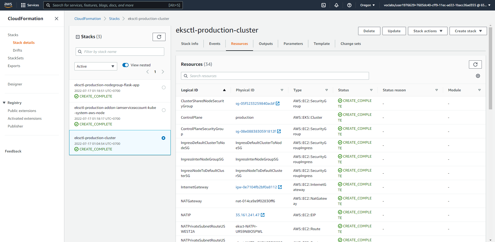
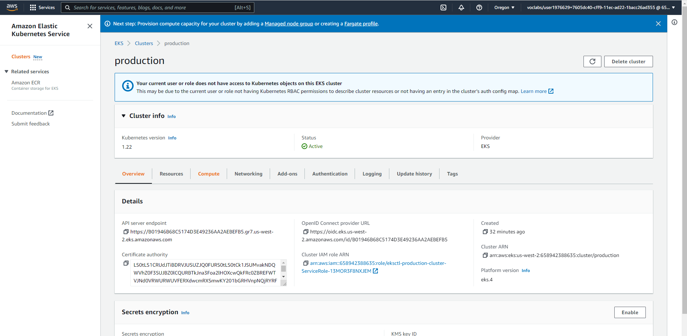
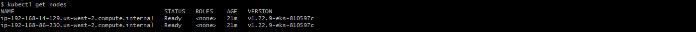
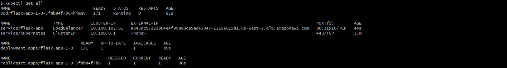
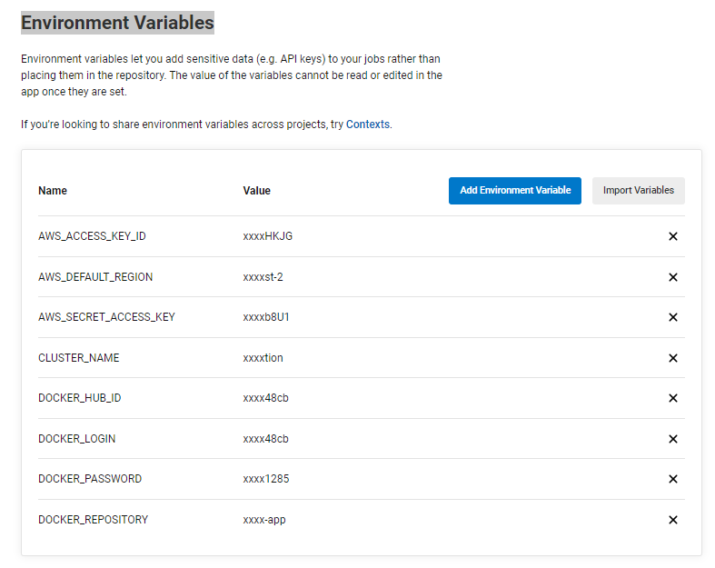
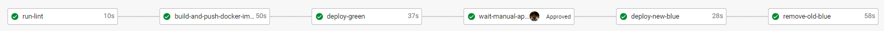
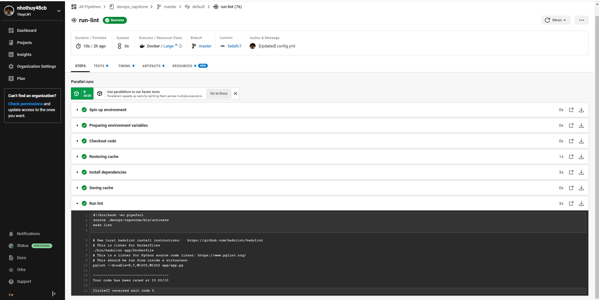
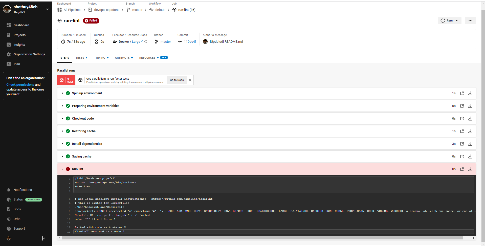
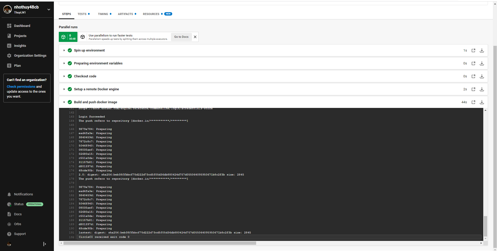
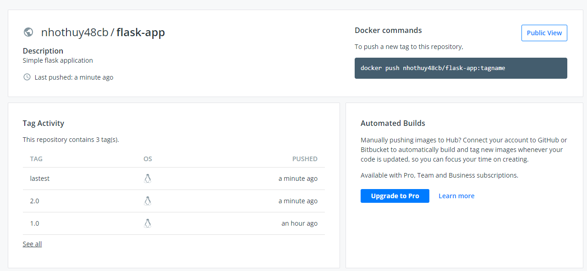

# Project Solution Screenshots

## Setup kubernetes cluster
### [cf_stack_eksctl_production_cluster.png](./cf_stack_eksctl_production_cluster.png)
 
### [eks_clusters_production.png](./eks_clusters_production.png)

### [kubectl_get_nodes.png](./kubectl_get_nodes.png)

### [kubectl_get_all_1.0.png](./kubectl_get_all_1.0.png)

## Setup CircleCI
### [circleci_environment_variables.png](./circleci_environment_variables.png)

## CI/CD Pipeline
### [circleci_pipeline.png](./circleci_pipeline.png)

### [run_lint.png](./run_lint.png)

### [run_lint_failed.png](./run_lint_failed.png)

### [build_publish_docker_image.png](./build_publish_docker_image.png)

### [flask_app_docker_image.png](./flask_app_docker_image.png)
